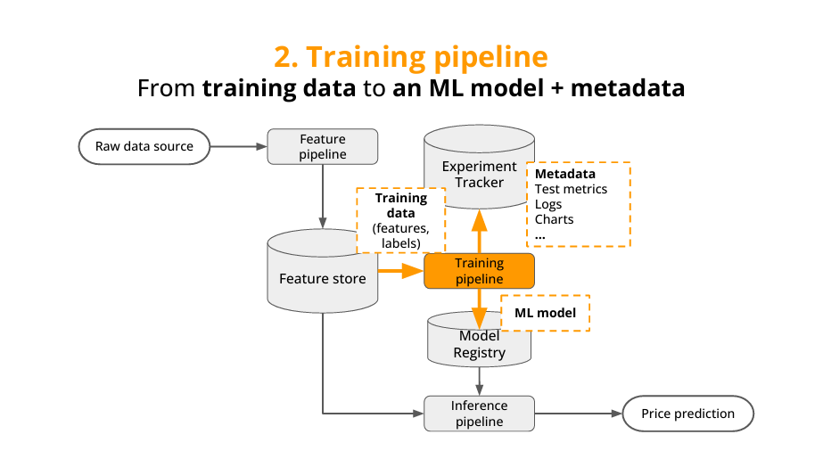

# Real-Time Crypto Price Prediction System

## Project Overview
A production-ready machine learning and LLM system that predicts cryptocurrency price movements in real-time using market data streams. The system processes live trade data to generate technical indicators and leverages them for short-term price predictions. 
## Technical Architecture

### Key Components
- **Feature Pipeline**: Real-time processing of trade data into OHLC candles and technical indicators using stateful stream processing

- **Training Pipeline**: Automated model training with experiment tracking and model registry integration

- **Inference Pipeline**: Real-time prediction serving via websocket API

- **Monitoring System**: Real-time model performance tracking and latency monitoring

### Technology Stack
- **Languages**: Python, Rust (for high-performance components)
- **Stream Processing**: Kafka/Redpanda, Quix Streams
- **ML Infrastructure**: Feature Store, Model Registry
- **Containerization**: Docker, Docker Compose
- **Code Quality**: Ruff for linting/formatting, Pre-commit hooks
- **Data Processing**: Stateful stream processing for real-time feature engineering

## Engineering Highlights

### High-Performance Data Processing
- Implemented efficient trade-to-candle conversion using stateful stream processing
- Optimized critical path components using Rust for microsecond-level latency
- Designed fault-tolerant data pipelines with proper error handling and monitoring

### Production-Ready Infrastructure
- Containerized microservices architecture for scalability and maintainability
- Automated code quality checks using pre-commit hooks and Ruff
- Comprehensive monitoring for both technical metrics and ML model performance

### ML Systems Design
- Feature Store implementation for consistent feature engineering in training and inference
- Automated model training pipeline with experiment tracking
- Real-time inference system with websocket API for low-latency predictions

## Impact and Results
- Successfully built an end-to-end ML system capable of real-time predictions
- Demonstrated ability to handle high-throughput data streams with low latency
- Implemented production-grade practices including monitoring, logging, and automated testin

## Development Practices
- Git-flow workflow with pre-commit hooks for code quality
- Microservices architecture for modularity and maintainability
- Comprehensive documentation and logging
- Automated testing and continuous integration

## Technical Deep Dives
Detailed documentation available for key components:
- Feature Pipeline Architecture
- Model Training Infrastructure
- Real-Time Inference System
- Monitoring and Alerting Setup

## Services
Detailed documentation available for key services:
- **Trades** - For trade data streaming from Kraken Websocket API
- **Candles** - For trade data transformation to Open, High, Low, Close and Volume (OHLCV)using Quixstream to a Kafka topic
- **Technical Indicator** - For technical indicator computing via Ta-Lib a technical indicator computing
- **News** - For fetching and prprocessing News data for NLP tasks
- **News Signal** - For processing and transformation of processed news data to trade signals and also push to Kafka topic
- **To Feature Store** - For pushing streamed features from Kafka to the Hopsworks feature store
- **Price Predictor** - For model training on the precessed OHLCV and News signal features from the feature store
- **Prediction API** - For the trade prediction API built with Rust

This project is truly exciting because I get to demonstrate my expertise in:
- Distributed Systems Design
- Real-Time Data Processing
- ML Infrastructure Development
- Production System Monitoring
- High-Performance Computing
